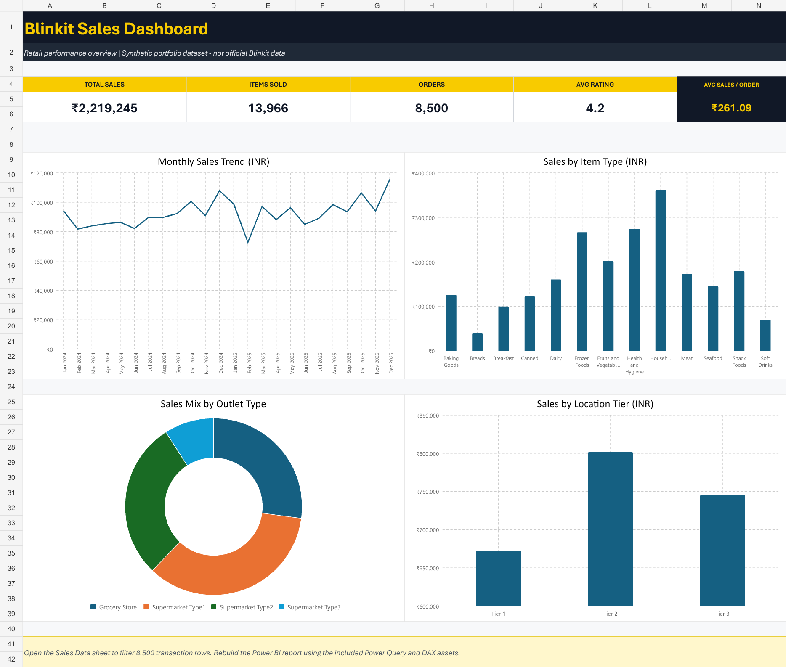

# Blinkit Sales Dashboard

An end-to-end retail analytics portfolio project that turns 8,500 synthetic transactions into an interactive executive dashboard. Explore sales momentum, product mix, outlet performance, customer segments, and transaction-level detail with responsive filters.

> **Important:** This is an independent educational project. Every row is computer-generated; no real Blinkit, customer, product, order, or outlet data is used. Blinkit is a trademark of its respective owner, and this project is not affiliated with or endorsed by Blinkit.



## Highlights

- Interactive filters for date, outlet location, outlet type, outlet size, item category, and customer type
- KPI cards for total sales, order count, units sold, average order value, and average rating
- Monthly trend, fat-content mix, category ranking, tier contribution, and outlet-format performance
- Searchable, paginated transaction explorer and filtered-view CSV export
- Dependency-free web dashboard built with vanilla HTML, CSS, JavaScript, and Canvas
- Companion Excel dashboard, Power Query transformation, reusable DAX measures, generator script, and data dictionary
- Responsive layout, keyboard focus states, accessible labels, and reduced-motion support

## Portfolio snapshot

The deterministic dataset currently produces:

| KPI | Result |
|---|---:|
| Transactions | 8,500 |
| Total sales | ₹2,219,245.45 |
| Units sold | 13,966 |
| Date range | 01 Jan 2024 – 31 Dec 2025 |
| Outlets | 11 |
| Catalog items | 920 |

## Run locally

Browsers restrict CSV loading when an HTML file is opened directly, so serve the folder locally:

```bash
python -m http.server 8000
```

Then open [http://localhost:8000](http://localhost:8000). No package installation or build step is required.

To reproduce the dataset exactly:

```bash
python scripts/generate_data.py
```

The generator uses a fixed seed (`20250814`) and validates row count, unique order IDs, positive sales, units, ratings, and outlet coverage before writing the CSV.

## Project structure

```text
blinkit-sales-dashboard/
├── index.html                         # Interactive web dashboard
├── assets/
│   ├── app.js                         # CSV parsing, filtering, charts, table, export
│   └── styles.css                     # Responsive dashboard design
├── data/
│   ├── blinkit_sales.csv              # 8,500 synthetic transactions
│   └── Blinkit_Sales_Data.xlsx        # Excel dashboard and source sheet
├── dax/measures.dax                   # Suggested Power BI measures
├── power-query/transform_data.m       # Power Query cleaning workflow
├── docs/
│   ├── data_dictionary.md             # Field-level definitions and assumptions
│   └── excel_dashboard_preview.png    # Excel dashboard preview
├── scripts/generate_data.py           # Deterministic data generator
├── LICENSE
└── README.md
```

## Data design

Each row represents one synthetic order line with a unique order ID. The model includes:

- transaction date and customer relationship segment;
- outlet identifier, market tier, size, format, and establishment year;
- item identifier, category, fat-content group, weight, visibility, and MRP;
- units, modeled sales, and synthetic rating.

Sales incorporate item price, quantity, seasonal demand, weekend behavior, customer loyalty, and bounded random variation. The dataset covers 1 January 2024 through 31 December 2025. See [the data dictionary](docs/data_dictionary.md) for complete definitions.

## BI workflow

1. Load `data/blinkit_sales.csv` into Power BI.
2. Apply `power-query/transform_data.m` and adjust the local file path in the `Source` step.
3. Name the resulting model table `Sales`.
4. Add a standard date table named `Date`, relate `Date[Date]` to `Sales[order_date]`, and mark it as a date table.
5. Create the measures in `dax/measures.dax` and use the included web or Excel dashboard as a layout reference.

## Tools and skills demonstrated

Data modeling, deterministic synthetic data generation, retail KPI design, Power Query M, DAX, Excel analytics, responsive front-end development, accessible interaction design, Canvas charting, and data validation.

## License

The project code is available under the [MIT License](LICENSE). The project name and visual references do not grant rights to any third-party trademark.
